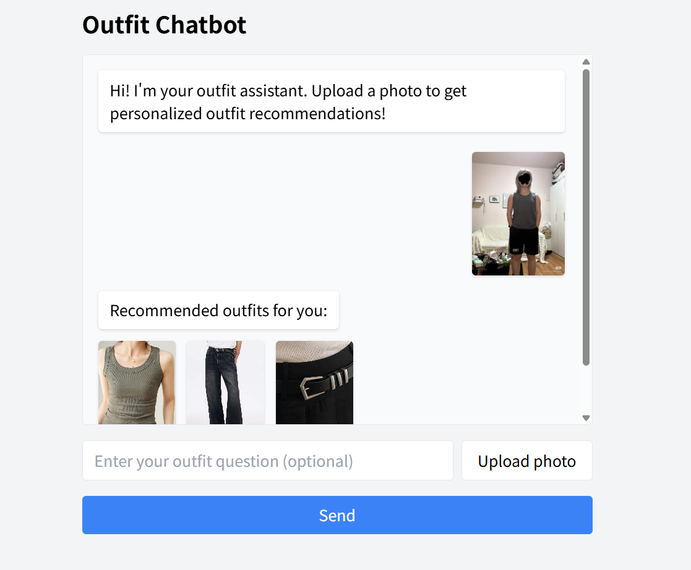
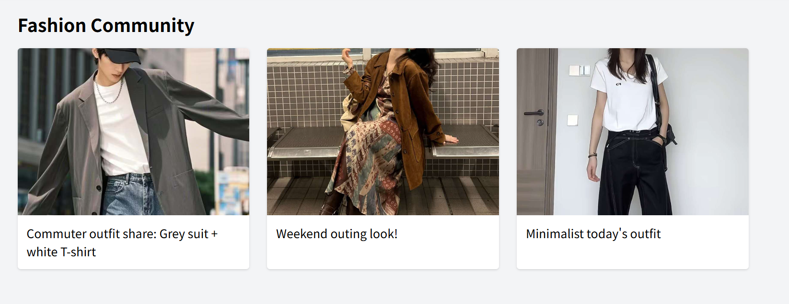
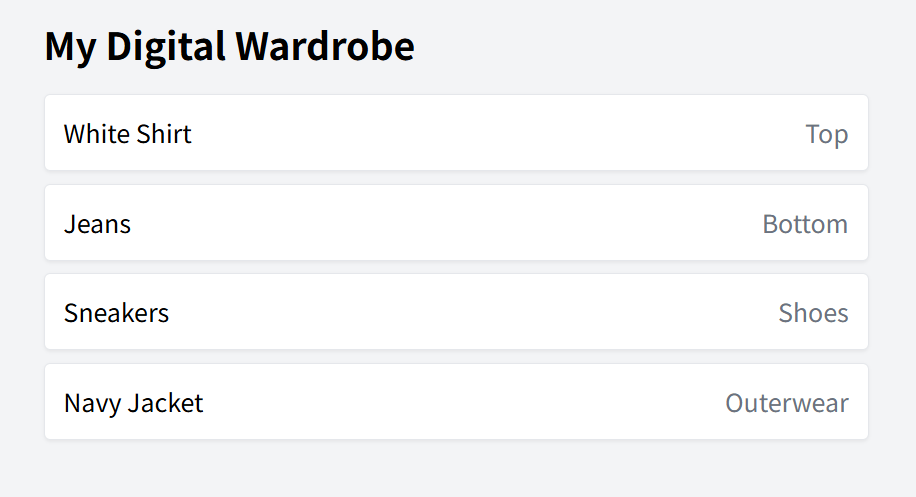

# 👗 AI Fashion Outfit Recommender (Frontend Demo)

This is a front-end demo for an AI-powered fashion outfit recommendation system. The application provides three key features:

1. **Chat-based outfit recommendations**  
2. **Community outfit sharing feed**  
3. **Digital wardrobe management**

> ⚠️ This is a static front-end demo only. No backend or AI model is integrated.

---

## 🚀 Features

### 1. 🗨️ Chat Recommendation
- Ask fashion-related questions via a chat interface
- Upload your photo to get personalized outfit suggestions (3 image replies)

### 2. 🌍 Community
- Browse shared outfit photos
- Each card shows a picture and a brief caption

### 3. 👕 Digital Wardrobe
- Displays a sample wardrobe with categories
- You can browse your items like tops, pants, shoes, etc.

---

## 🛠️ Tech Stack

- **React 18** + **Vite**
- **Tailwind CSS** for styling
- **React Router DOM** for navigation

---

## 📦 Installation & Run

```bash
# 1. Clone the repo
git clone https://github.com/maxzhangg/Style-Max-Demo.git

# 2. Install dependencies
npm install

# 3. Start the development server
npm run dev
```
Then open: http://localhost:5173

## 📁 Project Structure

```
.
├── public/             # Static images
├── src/                # React components and pages
│   ├── components/     # Navbar
│   └── pages/          # Chat, Community, Wardrobe
├── screenshots/        # UI screenshots
├── index.html
├── tailwind.config.js
├── postcss.config.js
├── package.json
└── ...
```

## 🖼️ Screenshots

### 💬 Chat Page


### 🧑‍🤝‍🧑 Community


### 🧥 Wardrobe


